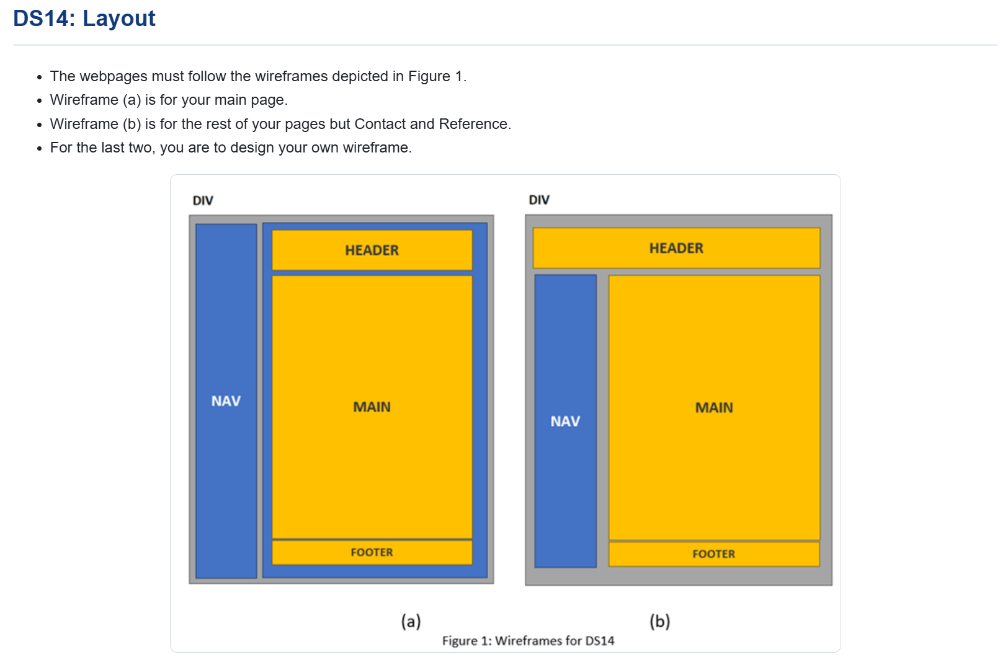

# Assessment 3 Website Design Report

**Course:** Introduction to Information Technology 4478/8936  
**Student ID:** u3311326  
**Topic:** The New Era of Artificial Intelligence. Are we finished?

No student name is included. Only the student ID is used, following the assessment formatting instruction.

# 1. Website Topic

The chosen topic is **The New Era of Artificial Intelligence. Are we finished?** This topic is selected from the approved list in the assessment brief. The website explains what artificial intelligence is, how it affects society, what future skills people need, and why people are not finished in the age of AI.

# 2. Site Map

The website uses a hierarchical site structure:

- Main.html
  - Impact.html
  - Future.html
  - Contact.html
  - References.html
  - MetaPage.html

The navigation menu appears on every page so users can move from any page to any other page easily.

# 3. DS14 Wireframes

The image below shows the official DS14 layout requirement. The submitted website follows these structures:

- **Main.html** follows **wireframe (a)**: vertical navigation on the left, with header, main and footer stacked in the right content column.
- **Impact.html**, **Future.html** and **MetaPage.html** follow **wireframe (b)**: header across the top, vertical navigation on the left, main content on the right, and footer below the main content.
- **Contact.html** and **References.html** use a custom layout, which DS14 allows for the last two pages.

# 4. Custom Wireframe for Contact.html and References.html

The custom Contact.html and References.html layout is:

| HEADER |
|---|
| HORIZONTAL NAVIGATION |
| MAIN CONTENT |
| FOOTER |

This layout was chosen because Contact and References pages need wider horizontal space for a form, Harvard references and source tables.

# 5. Design Specification Checklist

| Design specification | Implementation |
|---|---|
| DS1 Topic | The topic is selected from the approved topic list. |
| DS2 Pages | Main.html, Contact.html, References.html, MetaPage.html, Impact.html and Future.html are included. |
| DS3 Images | Every page includes images with alt text and width attributes. Border and alignment are styled in CSS for HTML5 validity. |
| DS4 Hyperlinks | External links are included in References.html and an email hyperlink is included in Contact.html and the footer. |
| DS5 Contact form | Contact.html includes a non-functional contact form with name, email, subject, priority, message and submit button. |
| DS6 Lists | Unordered, ordered and description lists are included across the website. |
| DS7 Symbols | UTF-8 symbols such as copyright, registered, trademark, star and arrow are used. |
| DS8 Writing elements | Line break, blockquote, strong and emphasis phrase elements are used. |
| DS9 Structural elements | div, header, nav, main and footer are used throughout the website. |
| DS10 CSS styling | External, embedded and inline CSS are included. |
| DS11 CSS properties | More than five listed CSS properties are used, including colour, background colour, font family, font size, font style, font weight, margins, text alignment, text decoration, text shadow and width. |
| DS12 Colour values | CSS colour values are coded in hexadecimal. |
| DS13 Selectors | External CSS includes class selectors and ID selectors. |
| DS14 Layout | Main.html follows wireframe (a). Impact.html, Future.html and MetaPage.html follow wireframe (b). Contact.html and References.html use custom layouts. |
| DS15 Tables | At least three table types are included, with borders, width, alignment, th/td styling, responsiveness, colspan and rowspan. |
| DS16 Validation | Placeholder validation screenshots are included and should be replaced with real W3C validation screenshots before submission. |
| DS17 Structure | The site map is implemented through the nav menu and documented in this Word file. |

# 6. Image and Multimedia Use

The website uses the supplied AI-themed images in the correct page locations:

- Home.png on Main.html
- Impact.jpg on Impact.html
- Future.jpg on Future.html
- Contact.png on Contact.html
- References.jpg on References.html
- MetaPage.png on MetaPage.html

Main.html also includes an embedded video for extra multimedia support.

# 7. Validation Evidence

The website folder includes validation placeholder images in the validation folder. Before final upload, these placeholders should be replaced with screenshots from:

- W3C Markup Validation Service: https://validator.w3.org/
- W3C CSS Validation Service: https://jigsaw.w3.org/css-validator/

# 8. Reference List

Encyclopaedia Britannica (2026) *Artificial intelligence*. Available at: https://www.britannica.com/technology/artificial-intelligence (Accessed: 28 April 2026).

IBM (2026) *What is artificial intelligence?* Available at: https://www.ibm.com/topics/artificial-intelligence (Accessed: 28 April 2026).

OpenAI (2026) *ChatGPT*. Available at: https://chatgpt.com/ (Accessed: 28 April 2026).

UNESCO (2026) *Ethics of Artificial Intelligence*. Available at: https://www.unesco.org/en/artificial-intelligence/recommendation-ethics (Accessed: 28 April 2026).

University of Canberra Library (2026) *Harvard referencing guide*. Available at: https://canberra.libguides.com/c.php?g=599301&p=6820165 (Accessed: 28 April 2026).

World Economic Forum (2025) *The Future of Jobs Report 2025*. Available at: https://www.weforum.org/publications/the-future-of-jobs-report-2025/ (Accessed: 28 April 2026).
